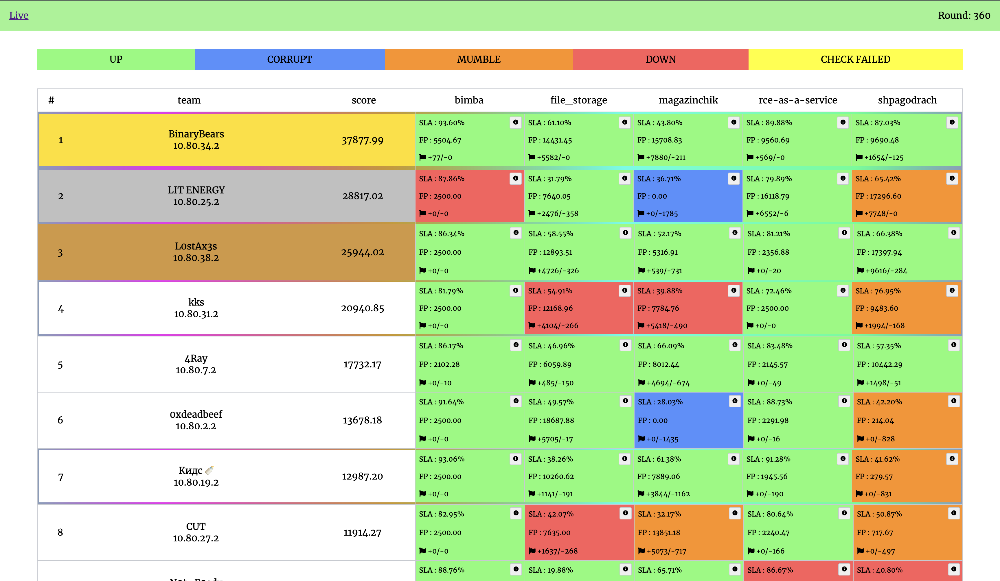

# AD Training 01.03.2025

Attack-Defense CTF training, which was developed by members of [dtl](https://ctftime.org/team/157017) and [Pudge Fun Club](https://ctftime.org/team/360461) teams.

## Services

| Service                                        | Language | Vulns                                                                                                                                     | Authors                                    |
| ---------------------------------------------- | -------- | ----------------------------------------------------------------------------------------------------------------------------------------- | ------------------------------------------ |
| [bimba](services/bimba/)                       | Java     | JWT key leak via XXE in docx                                                                                                              | @Demura                                    |
| [FileStorage](services/FileStorage/)           | Python   | sql injection in change() in db.py; LFI to rce in /upload; idor in /getfile?id={any id}; logic vuln in /register (you can overwrite user) | [@Sonya_nyaaa](https://t.me/Sonya_nyaaa)   |
| [magazinchik](services/magazinchik/)           | C++      | Buffer overflow in add_user, password reset in /forgot                                                                                    | [@ash](https://t.me/andrei_shpak_1523)     |
| [rce-as-a-service](services/rce-as-a-service/) | Rust     | Password leak via wasip2 socket api                                                                                                       | [@LeKSuS](https://github.com/LeKSuS-04)    |
| [shpagodrach](services/shpagodrach/)           | C        | leak flags over format string, RCE via null-termination error and vtable overwrite                                                        | @azod002, [@SEVA](https://t.me/CollapSeva) |

## Infrastructure

- DevOps: [@LeKSuS](https://github.com/LeKSuS-04)
- Checksystem: [ForcAD](https://github.com/pomo-mondreganto/ForcAD)

## Writeups

- [bimba](/sploits/bimba/)
- [FileStorage](/sploits/FileStorage/)
- [magazinchik](/sploits/magazinchik/)
- [rce-as-a-service](/sploits/rce-as-a-service/)
- [shpagodrach](/sploits/shpagodrach/)
